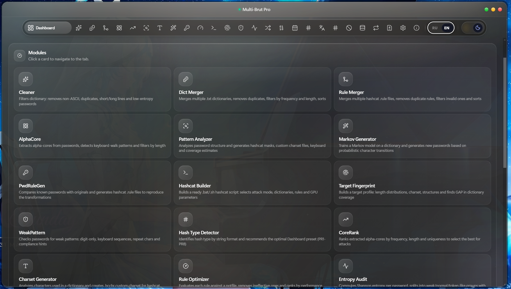
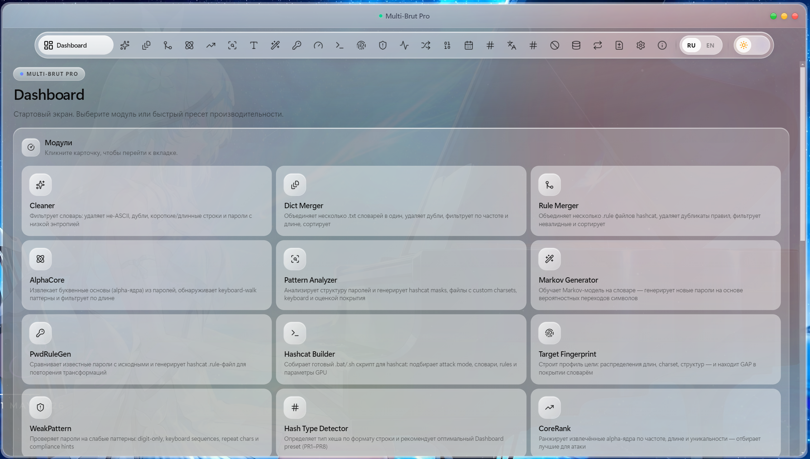

# Multi-Brut Pro

**Language / Язык:** [English](#english) · [Русский](#русский)

# English

> 💬 **Questions & access:** [@RootExploit0day](https://t.me/RootExploit0day) · **$150 crypto payment**

### Crack authorized hashes faster. Recover wallets smarter. Work with structure.

**Multi-Brut Pro — a professional desktop GUI application for authorized hash cracking workflows, cryptocurrency wallet password recovery, wordlist preparation, hashcat rules, masks, charsets, target profiling and password intelligence. 24 modules. One workflow. Cleaner input. Higher practical hit rate. Less wasted GPU time.**

---

## Why Multi-Brut Pro

Multi-Brut Pro is built for two serious scenarios: **authorized hash cracking** and **legitimate cryptocurrency wallet recovery**.

### For authorized hash cracking

- Generic wordlists often give low hit rate on real tasks.
- Bloated `.rule` files waste GPU time on useless transforms.
- Manual preparation takes hours before the real work starts.
- Poor input data creates noise, duplicates and missed opportunities.
- In CTF, audits and controlled environments, clean workflows and focused candidates win.

### For crypto wallet recovery

- You remember part of the password, but not the exact final string.
- You know you used a date, name, nickname, word or pattern — but not the final combination.
- You remember the password style, but not the exact case, symbols or order.
- Blind brute force wastes days on irrelevant candidates.
- Without structure, recovery turns into random guessing.

### Multi-Brut Pro solves both

Less preparation time.  
Cleaner wordlists.  
Smarter candidates.  
Better rule control.  
Hashcat-ready output.  
Higher practical hit rate.

> Multi-Brut Pro is intended only for legitimate recovery of your own wallets, authorized security testing, internal audits, research and CTF environments.

---

## Modules

### Preparation

| Module | Description |
|---|---|
| **Cleaner** | Cleans dictionaries from duplicates, non-ASCII lines, too short/long values, weak candidates and noise before recovery or cracking sessions. |
| **Dict Merger** | Merges multiple `.txt` dictionaries into one optimized wordlist with deduplication, length filters, frequency options and sorting. |
| **Rule Merger** | Merges multiple hashcat `.rule` files, removes duplicates and invalid rules, and prepares a cleaner rule set for controlled workflows. |
| **Negative Dedup** | Removes passwords already present in cracked potfile/cache from the active wordlist to avoid wasting GPU time. |
| **Competition Potfile Parser** | Extracts plaintext passwords from potfile, shows reused passwords and useful statistics for analysis and prioritization. |
| **Wordlist Diff** | Compares two wordlists and exports three clean sets: only A, only B and common lines. |

### Analysis

| Module | Description |
|---|---|
| **AlphaCore** | Extracts alphabetic cores from known passwords and helps separate useful bases from noisy data. |
| **CoreRank** | Ranks extracted alpha-cores by practical value so the strongest candidates can be tested first. |
| **Pattern Analyzer** | Analyzes password structures and exports recovery-oriented masks, custom charset files, keyboard insights and HTML reports. |
| **Custom Hashcat Charset** | Generates `.hcchr` custom charset files based on character distribution in source data. |
| **Target Fingerprint** | Builds a target profile: lengths, charset, structures, patterns and GAP coverage against available dictionaries. |
| **Weak Pattern Analyzer** | Detects weak password patterns: digit-only values, repeats, keyboard sequences and common structures. |
| **Entropy Analyzer** | Creates a Shannon entropy report and groups passwords into weak / normal / token-like categories. |
| **Hash Type Detector** | Detects the likely hash type by string format and recommends Dashboard preset PR1–PR8. |
| **Password Reuse Detector** | Shows which cracked passwords already exist in selected wordlists and helps estimate coverage. |

### Generation

| Module | Description |
|---|---|
| **Markov Generator** | Generates new candidates based on the style of the source dictionary. |
| **PwdRuleGen** | Creates a hashcat `.rule` file from known password transformations. |
| **Hybrid Mutation Engine** | Creates mutations: leet, years, case changes, truncation and character swaps. |
| **Pattern Expander** | Expands hashcat patterns like `?l?l?d?d` into controlled candidate wordlists. |
| **Date Wordlist Generator** | Generates date candidates in popular formats and year ranges. |
| **PIN Generator** | Creates PIN wordlists: full numeric ranges or top-N frequent PINs. |
| **Translit Generator** | Converts Cyrillic words into Latin variants: GOST, informal or combined mode. |

### Intelligence

| Module | Description |
|---|---|
| **Rule Optimizer** | Tests rules against potfile data, removes weak rules and ranks effective ones by practical hit rate. |
| **Hashcat Builder** | Builds ready `.bat` / `.sh` hashcat scripts with attack mode, dictionaries, rules and performance parameters. |

---

## Who Is This For

### ⚡ Authorized hash cracking tasks

For legal competitions, labs and controlled environments where clean wordlists, optimized rules and fast iterations directly affect the result.

### 💰 Recovery specialists

For professionals helping clients recover access to their own cryptocurrency wallets or authorized data. Speed, structure and hit rate directly affect success.

### 🔐 Crypto wallet owners

For people who lost access to their own Bitcoin, Ethereum or other cryptocurrency wallet, but still remember something — a date, word, nickname, pattern or password style.

### 🛡️ Pentesters and security auditors

For authorized internal audits, red team engagements and password security reviews where targeted wordlist preparation and password behavior analysis matter.

### 🏆 CTF players and security researchers

For legal lab environments where repeatable workflows, clean preparation and hashcat-ready outputs save time.

---

## Features At A Glance

- ⚡ **Higher practical hit rate** — targeted wordlists beat generic sets.
- 🧹 **Clean input** — remove noise before spending GPU cycles.
- 📊 **Target profiling** — understand what you are testing before you start.
- 🔬 **Rule optimization** — keep rules that actually produce value.
- 🧠 **Smart generation** — Markov, mutations, dates, PINs, translit and patterns.
- 🗓️ **Memory-to-candidate workflow** — turn fragments into structured recovery sets.
- 🏗️ **One-click scripts** — export hashcat-ready `.bat` / `.sh` scripts.
- 🖥️ **Desktop GUI** — visual workflow instead of dozens of disconnected scripts.
- 🌍 **EN / RU interface** — built for international users.
- 🌗 **Dark / Light theme** — comfortable for long sessions.
- 🧩 **24 specialized modules** — preparation, analysis, generation and intelligence in one toolkit.
- 🔐 **Authorized-use focus** — own wallets, audits, research and CTF.

---

## Contact & Access

Multi-Brut Pro is a **private paid desktop tool**.

- **Price:** `$150` crypto payment
- **Telegram:** [@RootExploit0day](https://t.me/RootExploit0day)
- **Interface:** English / Russian
- **Platform:** desktop GUI

> Multi-Brut Pro must be used only for legitimate recovery of your own wallets, authorized security audits, research and CTF environments. Do not use it against wallets, hashes, accounts or systems that you do not own.

---

# Русский

> 💬 **Вопросы и доступ:** [@RootExploit0day](https://t.me/RootExploit0day) · **$150 оплата криптой**

### Быстрее работать с авторизованными хешами. Умнее восстанавливать кошельки. Действовать по структуре.

**Multi-Brut Pro — профессиональное десктопное GUI-приложение для авторизованных hash cracking workflows, восстановления паролей от криптовалютных кошельков, подготовки словарей, hashcat rules, masks, charsets, профилирования целей и password intelligence. 24 модуля. Один workflow. Чище входные данные. Выше practical hit rate. Меньше потраченного GPU-времени.**

---

## Why Multi-Brut Pro

Multi-Brut Pro создан для двух серьёзных сценариев: **авторизованная работа с хешами** и **легитимное восстановление доступа к криптовалютным кошелькам**.

### Для авторизованного hash cracking

- Обычные generic wordlists часто дают низкий hit rate на реальных задачах.
- Раздутые `.rule` файлы тратят GPU-время на бесполезные трансформации.
- Ручная подготовка занимает часы ещё до начала основной работы.
- Плохое качество входных данных приводит к повторам, шуму и потерянным возможностям.
- В CTF, аудитах и controlled environments побеждают чистые workflows, быстрые итерации и точные кандидаты.

### Для восстановления криптокошельков

- Вы помните часть пароля, но не точную финальную строку.
- Вы знаете, что использовали дату, имя, никнейм, слово или паттерн — но не помните итоговую комбинацию.
- Вы помните стиль пароля, но не точный регистр, символы или порядок.
- Слепой brute force тратит дни на нерелевантные кандидаты.
- Без структуры восстановление превращается в хаотичные догадки.

### Multi-Brut Pro решает обе задачи

Меньше времени на подготовку.  
Чище словари.  
Умнее кандидаты.  
Лучше контроль rules.  
Hashcat-ready output.  
Выше практический hit rate.

> Multi-Brut Pro предназначен только для легитимного восстановления собственных кошельков, авторизованного security testing, внутренних аудитов, исследований и CTF-сред.

---

## Modules

### Preparation

| Module | Описание |
|---|---|
| **Cleaner** | Очищает словари от дублей, не-ASCII строк, слишком коротких или длинных значений, слабых кандидатов и лишнего шума перед recovery или cracking sessions. |
| **Dict Merger** | Объединяет несколько `.txt` словарей в один оптимизированный wordlist с дедупликацией, фильтрами длины, частотными параметрами и сортировкой. |
| **Rule Merger** | Объединяет несколько hashcat `.rule` файлов, удаляет дубли и невалидные правила, подготавливая более чистый набор для controlled workflows. |
| **Negative Dedup** | Удаляет из рабочего словаря пароли, которые уже есть в cracked potfile или cache, чтобы не тратить GPU-время повторно. |
| **Competition Potfile Parser** | Извлекает plaintext-пароли из potfile, показывает часто повторяющиеся пароли и даёт полезную статистику для анализа и приоритизации. |
| **Wordlist Diff** | Сравнивает два словаря и экспортирует три чистых набора: только в A, только в B и общие строки. |

### Analysis

| Module | Описание |
|---|---|
| **AlphaCore** | Извлекает буквенные ядра из известных паролей и помогает отделить полезные основы от шумных данных. |
| **CoreRank** | Ранжирует извлечённые alpha-ядра по практической ценности, чтобы сначала тестировать наиболее сильные кандидаты. |
| **Pattern Analyzer** | Анализирует структуры паролей и экспортирует recovery-oriented masks, custom charset файлы, keyboard-инсайты и HTML-отчёты. |
| **Custom Hashcat Charset** | Генерирует `.hcchr` custom charset файлы на основе закономерностей использования символов в исходных данных. |
| **Target Fingerprint** | Строит профиль цели по распределению длин, charset, структурам, паттернам и GAP-покрытию относительно доступных словарей. |
| **Weak Pattern Analyzer** | Проверяет слабые password-паттерны: digit-only значения, повторы, keyboard sequences и распространённые структуры. |
| **Entropy Analyzer** | Создаёт Shannon entropy отчёт и группирует известные пароли в weak, normal и token-like категории. |
| **Hash Type Detector** | Определяет вероятный тип хеша по формату строки и рекомендует оптимальный Dashboard preset PR1–PR8. |
| **Password Reuse Detector** | Показывает, какие cracked-пароли уже есть в выбранных wordlists, помогая оценить покрытие и password reuse behavior. |

### Generation

| Module | Описание |
|---|---|
| **Markov Generator** | Обучается на существующих password-style данных и генерирует новые кандидаты в похожем стиле. |
| **PwdRuleGen** | Создаёт hashcat `.rule` файлы на основе известных password-трансформаций для генерации реалистичных вариантов. |
| **Hybrid Mutation Engine** | Создаёт candidate-мутации из известных паролей: leet-замены, годы, смена регистра, обрезка и swap символов. |
| **Pattern Expander** | Раскрывает hashcat-style паттерны вроде `?l?l?d?d` в контролируемые wordlists кандидатов. |
| **Date Wordlist Generator** | Генерирует date-кандидаты в популярных форматах, диапазонах лет, с разделителями и календарными комбинациями. |
| **PIN Generator** | Создаёт PIN wordlists: полные цифровые диапазоны или top-N распространённых PIN-комбинаций. |
| **Translit Generator** | Конвертирует кириллицу в латинские варианты по ГОСТ, неформальной схеме или комбинированному режиму. |

### Intelligence

| Module | Описание |
|---|---|
| **Rule Optimizer** | Проверяет эффективность rules по potfile-данным, удаляет слабые правила и ранжирует оставшиеся по practical hit rate. |
| **Hashcat Builder** | Собирает готовые `.bat` или `.sh` hashcat scripts с выбранным attack mode, словарями, rules и performance-параметрами. |

---

## Who Is This For

### ⚡ Участники авторизованных hash cracking задач

Для легальных соревнований, лабораторий и controlled environments, где чистые wordlists, оптимизированные rules и быстрые итерации напрямую влияют на результат.

### 💰 Recovery-специалисты

Для профессионалов, которые помогают клиентам восстанавливать доступ к их собственным криптовалютным кошелькам или авторизованным данным. Скорость, структура и hit rate напрямую влияют на успешность восстановления.

### 🔐 Владельцы криптокошельков

Для людей, которые потеряли доступ к своему Bitcoin, Ethereum или другому криптовалютному кошельку, но всё ещё помнят что-то — дату, слово, никнейм, паттерн или стиль пароля.

### 🛡️ Пентестеры и security-аудиторы

Для авторизованных внутренних аудитов, red team engagements и password security reviews, где важны targeted wordlist preparation и анализ password behavior.

### 🏆 CTF-участники и security-исследователи

Для легальных лабораторных сред, где повторяемые workflows, чистая подготовка и hashcat-ready outputs экономят время.

---

## Features At A Glance

- ⚡ **Выше practical hit rate** — targeted wordlists эффективнее generic-наборов.
- 🧹 **Чистые входные данные** — удаление шума до затрат GPU cycles.
- 📊 **Target profiling** — понимание того, что именно вы тестируете.
- 🔬 **Rule optimization** — остаются только rules, которые дают ценность.
- 🧠 **Smart generation** — Markov, mutations, dates, PINs, translit и patterns.
- 🗓️ **Memory-to-candidate workflow** — превращение фрагментов памяти в structured recovery sets.
- 🏗️ **One-click scripts** — экспорт hashcat-ready `.bat` / `.sh` scripts.
- 🖥️ **Desktop GUI** — визуальная работа без десятков разрозненных скриптов.
- 🌍 **EN / RU interface** — удобно для международных пользователей.
- 🌗 **Dark / Light theme** — комфортно для долгих сессий.
- 🧩 **24 специализированных модуля** — preparation, analysis, generation и intelligence в одном toolkit.
- 🔐 **Фокус на авторизованном использовании** — собственные кошельки, audits, research и CTF.

---

## Contact & Access

Multi-Brut Pro — это **приватный платный desktop-инструмент**.

- **Цена:** `$150` оплата криптой
- **Telegram:** [@RootExploit0day](https://t.me/RootExploit0day)
- **Интерфейс:** English / Russian
- **Платформа:** desktop GUI

> Multi-Brut Pro должен использоваться только для легитимного восстановления собственных кошельков, авторизованных security-аудитов, исследований и CTF-сред. Не используйте против кошельков, хешей, аккаунтов и систем, которые вам не принадлежат.
